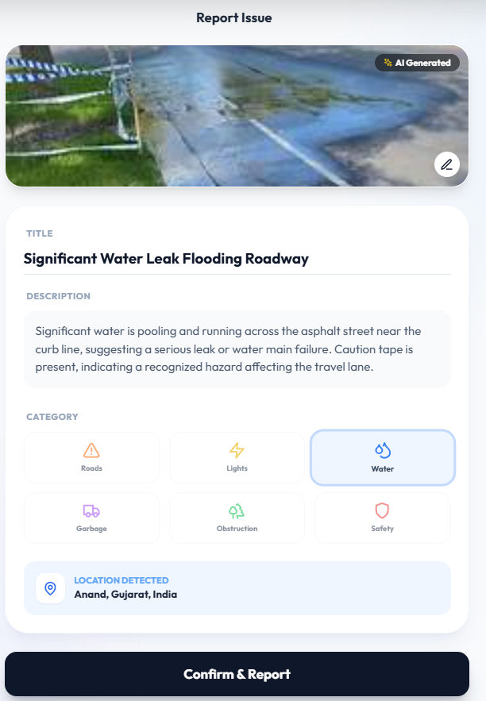
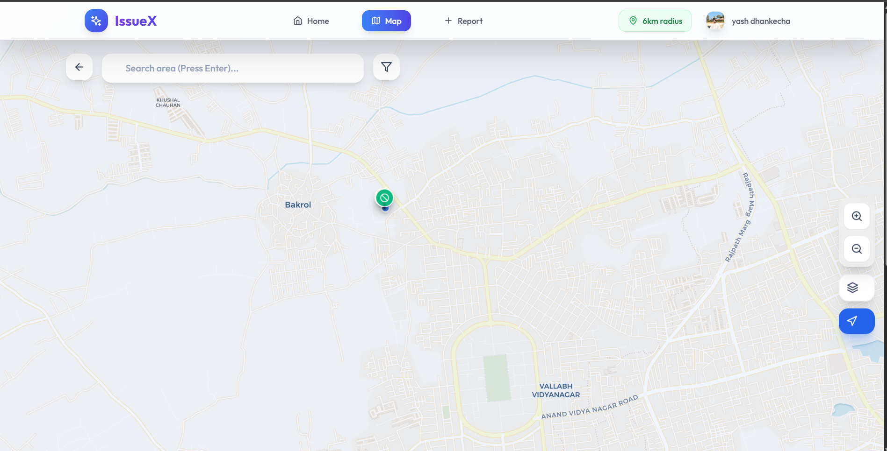

<div align="center">

# 🚧 IssueX - Smart Civic Issue Tracker 🚧

[](https://mongodb.com)
[](https://deepmind.google/technologies/gemini/)
[](https://developers.google.com/maps)
[]()

> **"Snap. Scan. Solved."**
>
> A next-gen civic issue reporting platform powered by **Google Gemini AI** and **Google Maps**.  
> We make reporting potholes, garbage, and broken lights as easy as taking a selfie.

<br />

### [🔴 VIEW LIVE DEMO](https://issuex.netlify.app/)
*(Note: Link is a placeholder, deploy to activate)*

<br />

</div>

---

## 💎 Google Cloud Services Used

This project heavily leverages Google's ecosystem to provide a smart, seamless experience.

| Service | Feature Implementation | Impact |
| :--- | :--- | :--- |
| **Google Gemini 2.0 Flash** | **Automated Issue Analysis**<br>Scans user-uploaded photos to automatically detect the *Issue Title*, *Category*, *Severity*, and generate a *Description*. | Reduces reporting time by **80%**. No more typing long descriptions manually. |
| **Google Maps Geocoding API** | **Smart Address Resolution**<br>Converts raw GPS coordinates (Lat/Lng) into a readable street address (e.g., "Sector 14, MG Road"). | Ensures authorities know exactly *where* the issue is without guessing. |
| **Google Maps JavaScript API** | **Interactive Visualization**<br>Renders dynamic maps (via Leaflet adapter) for pinpointing issues and visualizing coverage. | Provides a spatial understanding of civic problems. |
| **Firebase Authentication** | **Secure Identity**<br>Handles user sign-ups, log-ins, and session security seamlessly. | Trusted, secure, and fast authentication for every user. |

---

## 🔥 Comprehensive Features

### 👤 For Citizens (Users)
*   **📸 AI-First Reporting**: Just upload a photo. Gemini AI fills out the form (Title, Desc, Category, Severity) for you.
*   **📍 Location Intelligence**: Automatic location detection with visual map confirmation.
*   **👍 Community Voting**: Upvote issues that matter to you. Higher votes = Higher priority.
*   **💬 Discussion Threads**: Comment on issues to provide updates or ask questions.
*   **🔔 Real-time Notifications**: Get notified when an issue you reported or followed gets fixed.
*   **🔍 Advanced Filtering**: Find issues by radius (e.g., "5km near me"), category, or status.
*   **📊 Personal Dashboard**: Track the status of your reported issues in one place.

### �️ For Authorities (Admins)
*   **📉 Analytics Dashboard**: See high-level stats (Total Issues, Resolved Count, Category Breakdown).
*   **🚦 Status Management**: Update issue status (`Reported` → `In Progress` → `Resolved`).
*   **🗺️ Heatmap View**: Identify problem hotspots in the city (e.g., "Why are there so many potholes in Sector 5?").
*   **⚡ Priority Sort**: AI-detected severity + User Votes helps in triaging critical tasks first.

---

## 🛠️ Tech Stack

<div align="center">

| Area | Technology |
| :--- | :--- |
| **Frontend** | React + Vite + TailwindCSS + Framer Motion + Lucide Icons |
| **Backend** | Node.js + Express + MongoDB (Mongoose) |
| **AI Engine** | **Google Gemini 2.0 Flash / 1.5 Flash** (via `@google/generative-ai`) |
| **Maps Service** | **Google Maps Geocoding API** + React-Leaflet |
| **Auth** | Firebase Authentication + JWT |
| **Storage** | Cloudinary (Image Optimization & Hosting) |

</div>

---

## 🚀 Quick Start Guide

Want to run this locally? Follow these steps:

### 1. Clone & Install
```bash
git clone https://github.com/yashdhankecha/issuex.git
cd issuex by

# Install Backend
cd server
npm install

# Install Frontend (new terminal)
cd ../client
npm install
```

### 2. Configure Environment
Create a `.env` file in the `server/` folder with your keys:
```env
# Server
PORT=5000
MONGODB_URI=mongodb://localhost:27017/issuex

# Google Cloud (REQUIRED for AI & Maps)
GEMINI_API_KEY=your_gemini_key_here
GOOGLE_MAPS_API_KEY=your_google_maps_key_here

# Cloudinary (For Images)
CLOUDINARY_CLOUD_NAME=your_cloud_name
CLOUDINARY_API_KEY=your_api_key
CLOUDINARY_API_SECRET=your_api_secret

# Firebase & Auth
JWT_SECRET=super_secret_key
```

### 3. Run It!
```bash
# Terminal 1 (Server)
cd server
npm run dev

# Terminal 2 (Client)
cd client
npm run dev
```
Visit `http://localhost:5173` and start reporting!

---

## � Application Preview

*(Add your screenshots here)*

| **AI Auto-Analysis** | **Interactive Map** |
| :---: | :---: |
|  |  |
| *Gemini scans and fills details automatically* | *Visualizing issues across the city* |

---

<div align="center">
  
**Made with ❤️ BY Tripod**

[Star this Repo ⭐](#) • [Report Bug 🐛](#)

</div>